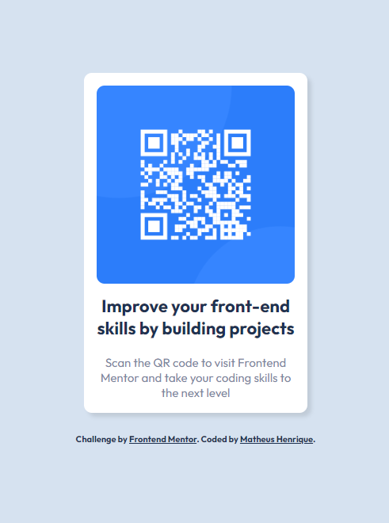
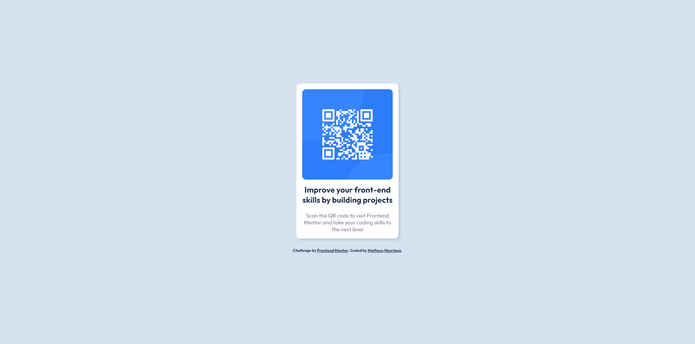

# Frontend Mentor - QR code component solution

This is a solution to the [QR code component challenge on Frontend Mentor](https://www.frontendmentor.io/challenges/qr-code-component-iux_sIO_H). Frontend Mentor challenges help you improve your coding skills by building realistic projects.

## Table of contents

- [Overview](#overview)
  - [Screenshot](#screenshot)
  - [Links](#links)
- [My process](#my-process)
  - [Built with](#built-with)
  - [What I learned](#what-i-learned)
  - [Continued development](#continued-development)
  - [Useful resources](#useful-resources)
- [Author](#author)

## Overview

### Screenshot




### Links

- Solution URL: [Frontend Mentor Solution](https://www.frontendmentor.io/challenges/qr-code-component-iux_sIO_H)
- Live Site URL: [GitHub Pages](https://henry-frontend.github.io/qr-code-component/)

## My process

### Built with

- Semantic HTML5 markup
- CSS
- Flexbox
- Mobile-first workflow

### What I learned

During this project, I deepened my understanding of CSS Flexible Box Layout (Flexbox). Flexbox proved to be an incredibly powerful tool for creating flexible and responsive layouts. I learned how to use properties like display: flex, flex-direction, justify-content, and align-items to manipulate the layout and positioning of elements within a container.

Here's an example of how I used Flexbox to create a centered container with horizontally aligned items:

```css
.proud-of-this-css-and-flexbox {
  background-color: #d6e2f0;
  display: flex;
  flex-direction: column;
  align-items: center;
  justify-content: center;
  height: 96vh;
}
```

By leveraging Flexbox, I was able to achieve the desired layout and easily adjust the positioning of elements based on different screen sizes or content requirements. It has become an essential tool in my toolkit for creating modern and responsive web designs.

### Continued development

- Deepen my knowledge in semantic HTML and web accessibility to create more inclusive websites.
- Deepen my knowledge in CSS Flexible Box Layout and CSS Grid Layout to create more flexible and responsive layouts.
- Practice building responsive projects for mobile devices, following a "mobile-first" approach.
- Experiment with style libraries like Styled Components or Tailwind CSS to enhance the appearance of my projects.
- Explore the basics of JavaScript and practice writing simple scripts to add interactivity to my projects.
- Gradually learn TypeScript, starting with the fundamentals and applying them in small projects.
- Learn about React and practice creating simple and functional components.
- Participate in coding challenges and competitions to gain more hands-on experience and tackle new challenges.
- Seek educational resources such as tutorials and courses to continue learning and improving my skills.

### Useful resources

- [Flexbox Froggy](https://flexboxfroggy.com/) - This interactive game helped me understand and practice the concepts of CSS Flexible Box Layout (Flexbox) in a fun way. It was a useful resource during the challenge.
- [Flexbox Adventure](https://codingfantasy.com/games/flexboxadventure) - This is another interactive tool that helped me enhance my knowledge of CSS Flexible Box Layout (Flexbox). Through mini-games, I was able to explore and experiment with Flexbox properties in a fun and educational manner.

## Author

- Frontend Mentor - [@henry-frontend](https://www.frontendmentor.io/profile/henry-frontend)
- Twitter - [@henry_frontend](https://twitter.com/henry_frontend)
